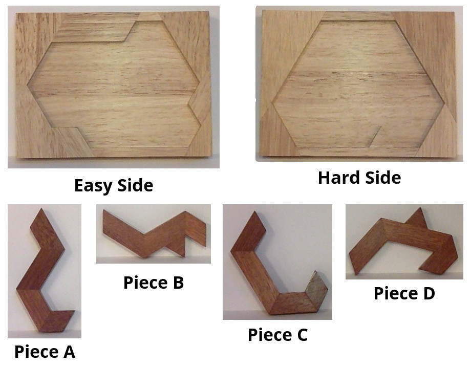
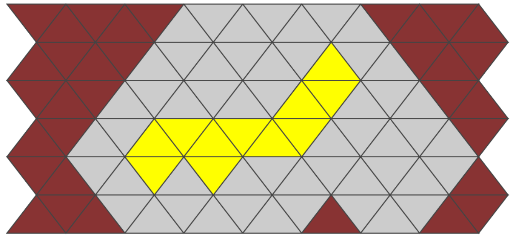
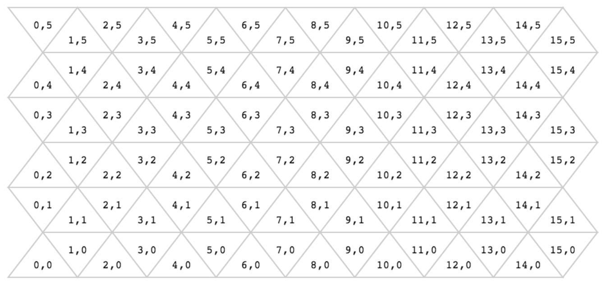
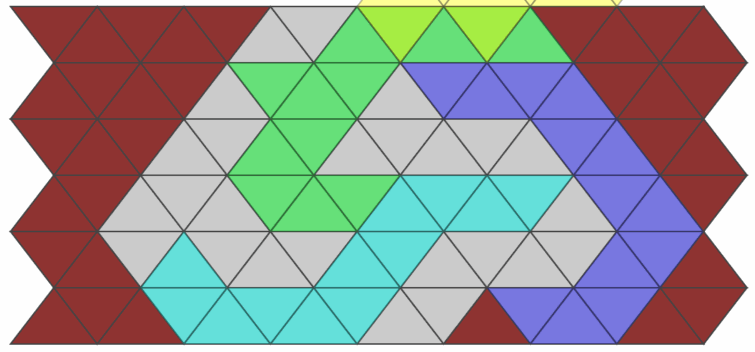

+++
title = "Solving a wooden puzzle"
date = "2015-04-27"
+++

Last week a mysterious double-sided puzzle appeared at [Khan Academy](https://www.khanacademy.org/).

To solve the puzzle you must fit all four pieces inside the recessed area (the pieces will not entirely fill the area). We found a solution to the easy side after only a few days[^1] but nobody could get close to solving the hard side. So five of us began writing our own solvers.

The first question each of us faced was how to represent the positions of the pieces. We were able to lay down a triangular grid on top of each side, but how should the cells be addressed?

Each of us came up with our own answer to this question[^2]. I decided to use a coordinate system that used two perpendicular axes, with the origin at the bottom left.

I had a problem though. Once I manually input a piece into my coordinate system, I needed to be able to rotate and reflect that piece into 12 different alignments. Reflection was easy, but despite my best efforts, I couldn't figure out how to rotate the pieces once they were placed into my grid.

After smashing my head against the problem for an hour and getting nowhere, I gave up[^3]. I instead decided to manually input each of the three rotations necessary for each piece (all the other alignments could be expressed as reflections of those rotations).

Now I just had to write the logic to try every possible placement of the pieces.

By this time, Ben Eater's solver was done and ticking away. [His solver](https://www.khanacademy.org/computer-programming/spin-off-of-puzzle/4900481558249472) didn't do any pruning of the search space though (and took some time to check each placement), so he estimated that the solver would finish in around 2 years. I felt good about my chances of finding a solution before then.

To try and be a little faster I added in some logic to prune large parts of the search space where possible. This worked by laying down a piece at a time, and only trying the other ones if there were no collisions.

For example, first my program would lay down Piece A somewhere. If Piece A collided with a wall, my program would not try laying down Piece B yet, but would instead move Piece A somewhere else. Similarily, once it came time to lay down

This ended up working well and soon I had [my solver](https://github.com/itsjohncs/damn-puzzle/blob/master/boom.js) that could brute force the puzzle in less than a minute.

Emily finished [her solver](https://github.com/xymostech/wood-puzzle/blob/master/src/Main.hs) around the same time and we were able to confirm our results. **The hard side of the puzzle was unsolvable**.

Clearly there was a very evil puzzle master in our ranks.

[Jamie Wong](http://jamie-wong.com/) readily admitted to bringing in the puzzle (though he didn't tell us where he got it). Despite the staggering proof to the contrary though, he was adamant that a solution existed. He said our solvers all shared a fatal flaw.

After a few hints, Emily and I did find the answer[^4]. Which was good, because none of us had gotten any work done for a little while and we were starting to feel guilty.

[^1]: If you want to spoil it for yourself, here is [a picture of the solved easy side](./easy-solved.jpg>).
[^2]: Ben Eater decided to side-step the issue by drawing the shapes directly onto the screen. Cam Christensen came up with a coordinate system with two axes that formed a 60° angle and he convinced Emily Eisenberg to use the same system. Justin Helps used a screen-based coordinate system like Ben Eater, but tracked all three vertices of each triangle.
[^3]: [Emily was actually able to figure out rotation](https://github.com/xymostech/wood-puzzle/blob/f7ea685855c06531debcc9e6105451c934a00cde/src/Main.hs#L35) (though her coordinate system was different in that the axes formed a 60° angle).
[^4]: You don't really want me to give you the answer do you? That would be boring.
